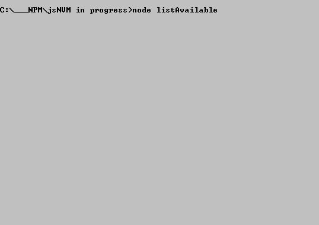

# W4it 
A simple yet useful NodeJS module that provide Wait Sleep and other async funcionality

You can easily install  by using Bower, a package manager for front-end components.

`bower install w4it`

 
 

you may also wanna check out this example of usage online [Complete Node Version List](http://cloned2k16.github.io/jsNVM/)
 where it's used to sync two request to different sites and then mix up togheter the results
 showing the complete list of Node Releases either coming from Node or IO.JS

